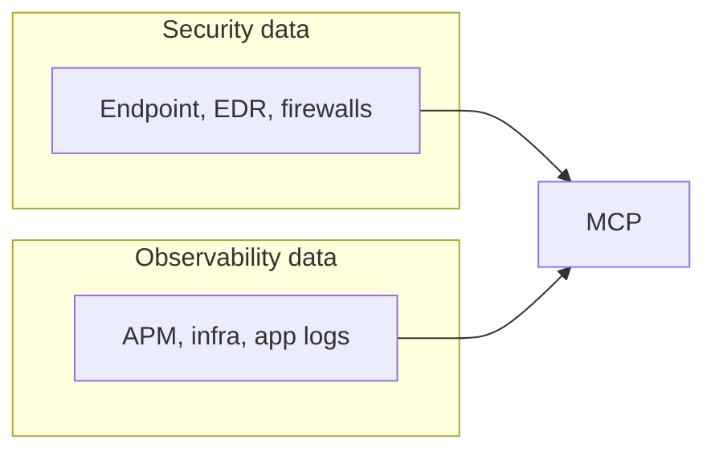

# o11y-security

Workshop and lab assets for **Agent Builder agent-to-agent (A2A)** patterns across **Elastic Cloud Serverless Observability** and **Elastic Cloud Serverless Security**: separate clusters, API-first wiring, and enriched security events with observability context.

## Why this matters: silos, AI, and MCP

Companies historically operated with **separate stacks** for platform and end users, which makes it hard to solve **AI and analytics use cases** that need unified context.

### Current state: data analytics platforms

Typical flow: **Ingest → Store → Query**

- **Observability (O11y)** telemetry is siloed per team or per cluster.
- **Business data** is often not correlated or not ingested into the same analytical plane.
- **Security** teams frequently duplicate or re-copy security logs into yet another store.
- **Data quality and retention** strategy is unclear or inconsistent across domains.
- **Cost and ownership** models become overcomplicated for platform teams.

### Downstream impact: systems of action

What organizations feel when those silos persist:

- A large **shadow IT** estate of ad hoc tools and exports.
- A **best-in-class patchwork** of point solutions instead of one coherent story.
- **Security and O11y teams** still operating in parallel, not in joint workflows.
- **Missed correlation** between signals that only make sense together (attack vs. customer impact).
- **Wrong outcomes** and **dropped data** when decisions are made without full context.

### The bridge: MCP unifies Security and Observability

Elastic uses **MCP** (Model Context Protocol) to connect **security** and **observability** telemetry into **one analytical platform**, reducing silos and enabling cross-domain workflows—from triage to GenAI-assisted investigation.

This repository’s **Agent Builder A2A** lab is one concrete pattern on that path: **Security** agents ask **Observability** for live context over APIs, so enriched incidents answer *“was this attack coupled with real user or service pain?”* without duplicating the entire analytics stack.

**Scope check:** lab **workflows** (alert → case, scheduled/manual **synth inject**) are there to **simulate traffic** and **practice response** in each Kibana. They are **not** the cross-project bridge. The bridge is the **HTTPS call** from the Security enrichment agent to the Observability agent (**agent-to-agent**), wired after **Agent Builder** publish + instructions—see the cloud path’s **`AGENT_BUILDER.md`** and **`05-agent-builder-lab-agents.sh`**.

## Goals

- Stand up **two** serverless projects (Observability + Security) the way many customers run them: **split ownership**, shared narrative.
- Teach a **Security** detection agent to call an **Observability** context agent over **HTTPS**, merge responses, and index **correlated** documents for dashboards and automation.
- Offer a **fast scripted path** on real Elastic Cloud projects, plus an **Instruqt** track for guided delivery—port from the former to the latter as the story stabilizes.

## Repository layout

| Path | What it is |
| ---- | ----------- |
| [`elastic-agent-builder-a2a-workshop/`](elastic-agent-builder-a2a-workshop/) | **Instruqt** track (`elastic-a2a-serverless-agent-builder`): `track.yml`, `config.yml`, dual **Serverless** Kibana tabs via one **workstation** nginx proxy (ports 8080/8081), challenges (`01-`…`06-`), index templates, sample NDJSON/JSON, lifecycle scripts, agent scaffolds. **How to run:** [`elastic-agent-builder-a2a-workshop/README.md`](elastic-agent-builder-a2a-workshop/README.md). |
| [`elastic-agent-builder-a2a-cloud-path/`](elastic-agent-builder-a2a-cloud-path/) | **Cloud path** (no Instruqt): **[elastic/agent-skills](https://github.com/elastic/agent-skills)** is the recommended prerequisite; use **`SKILLS-FIRST-WORKFLOW.md`** for provisioning + keys + Agent Builder via skills. Bash `scripts/` remain for CI/headless. See **`README.md`** (includes **Exercise the setup** for Skills + bash paths), **`AGENT_BUILDER.md`**. |
| [`docs/`](docs/) | Short **GitHub Pages** slide deck (`index.html`) for the value prop; optional marketing aid, not the main lab. |
| [`.github/ISSUE_TEMPLATE/`](.github/ISSUE_TEMPLATE/) | **GitHub issue templates** — open **Security-side**, **Observability-side**, or **cross-domain A2A** issues so backlog stays split by persona (e.g. lateral movement / code-execution scenarios vs. SLO or service-impact work). |

## Two ways to run the lab

### A) Instruqt (facilitator-led)

1. Clone this repo and use the Instruqt CLI against `elastic-agent-builder-a2a-workshop/` (see [Instruqt docs](https://docs.instruqt.com/) for `track push`, sandboxes, and secrets).
2. Learners get a **workstation** container plus instructions to create **two** Elastic Cloud projects (or you pre-seed credentials via Instruqt secrets and track scripts).
3. Challenges walk Kibana Agent Builder steps, A2A wiring, and a correlation dashboard.

Start at: [`elastic-agent-builder-a2a-workshop/track.yml`](elastic-agent-builder-a2a-workshop/track.yml) (Instruqt slug **`elastic-a2a-serverless-agent-builder`** — push as a **new** track in your org when you are ready).

### B) Elastic Cloud + Agent Skills (outside Instruqt)

**Prerequisite:** install **[Elastic Agent Skills](https://github.com/elastic/agent-skills)** (official library for Cursor, Claude Code, Copilot, etc.). Use it to run **cloud-setup**, **cloud-create-project** (Observability + Security), **cloud-manage-project**, **elasticsearch-authn**, and **kibana-agent-builder** instead of hand-rolling Cloud/ES steps.

1. Follow **[`elastic-agent-builder-a2a-cloud-path/SKILLS-FIRST-WORKFLOW.md`](elastic-agent-builder-a2a-cloud-path/SKILLS-FIRST-WORKFLOW.md)** with your AI agent.
2. Optionally run bash helpers for **index templates + bulk** only (see workflow doc), or stay entirely in skills for ingest.
3. Use **[`elastic-agent-builder-a2a-cloud-path/AGENT_BUILDER.md`](elastic-agent-builder-a2a-cloud-path/AGENT_BUILDER.md)** plus the **[agent-builder](https://github.com/elastic/agent-skills/blob/main/skills/kibana/agent-builder/SKILL.md)** skill for Agent Builder steps.

**Headless / CI fallback:** same folder’s `scripts/run-all.sh` + `.env` — see [`elastic-agent-builder-a2a-cloud-path/README.md`](elastic-agent-builder-a2a-cloud-path/README.md).

## Exercise the lab (after setup)

- **Elastic Cloud + Agent Skills or `run-all.sh`:** follow **Exercise the setup** in [`elastic-agent-builder-a2a-cloud-path/README.md`](https://github.com/poulsbopete/o11y-security/blob/main/elastic-agent-builder-a2a-cloud-path/README.md) — two sub-paths (**Path 1 — Agent Skills**, **Path 2 — Bash**), then Kibana checks, optional [`simulate-cross-domain-load.sh`](elastic-agent-builder-a2a-workshop/scripts/simulate-cross-domain-load.sh), and A2A HTTP / workflow pointers.
- **Instruqt or workshop-only scripts:** follow **Exercise the setup** in [`elastic-agent-builder-a2a-workshop/README.md`](https://github.com/poulsbopete/o11y-security/blob/main/elastic-agent-builder-a2a-workshop/README.md) — challenge order, `Check` steps, and BYO-cluster script flow.

## Agent Builder (manual in Kibana)

Authoring stays in **Agent Builder** in each project. Payload shapes and pseudocode live under:

[`elastic-agent-builder-a2a-workshop/agent-scaffolds/`](elastic-agent-builder-a2a-workshop/agent-scaffolds/)

Target indices (examples used in the workshop):

- `.elastic-agents-security-detections`
- `.elastic-agents-security-a2a-enriched`
- Synthetic bulk indices: `workshop-synth-*` (loaded by scripts for demos)

## Slides (GitHub Pages)

A **6-slide** value deck lives in [`docs/index.html`](docs/index.html), with an animated **CSS “FallingPattern”** background ([`docs/pattern.css`](docs/pattern.css))—static Pages, no React build. After enabling **Pages** from the **`/docs`** folder on `main`, it is served at:

**https://poulsbopete.github.io/o11y-security/**

**AE enablement:** copy-ready **AI prompts** for seller coaching (personas, discovery, objections) live under [`docs/prompts/`](docs/prompts/) and are linked from slides 3–5 and the footer. Slide 4 text tracks the **`elastic-agent-builder-a2a-cloud-path`** lab (bidirectional alert workflows, scheduled inject off by default, ~60s HTTP caveat).

Setup notes: [`docs/README.md`](docs/README.md).

**Optional (Vercel):** deploy the same `docs/` site with a **server-side** `POST /api/converse` proxy so the **A2A help** chat works without CORS or pasting a Kibana API key in the browser. Use **Root Directory** `web` and env vars from [`web/README.md`](web/README.md).

## Security notes

- Never commit **`.env`**, **`state/`** under the cloud path, **`.elastic-credentials`**, or API keys. This repo’s `.gitignore` excludes common secret paths.
- Narrow the role in [`elastic-agent-builder-a2a-cloud-path/scripts/api-key-body.json`](elastic-agent-builder-a2a-cloud-path/scripts/api-key-body.json) before customer-facing demos (it is intentionally broad for lab speed).

## Elastic Agent Skills (official)

All skills referenced above live in **[elastic/agent-skills](https://github.com/elastic/agent-skills)** (install per that repo). They are the **preferred** way to provision Cloud Serverless projects and operate Elasticsearch/Kibana from an AI agent; the bash scripts in `elastic-agent-builder-a2a-cloud-path/scripts/` are a **fallback** for automation without an agent runtime.

## License / status

Internal / field enablement material unless otherwise noted. Update this README as the Instruqt track and Cloud API payloads evolve.
