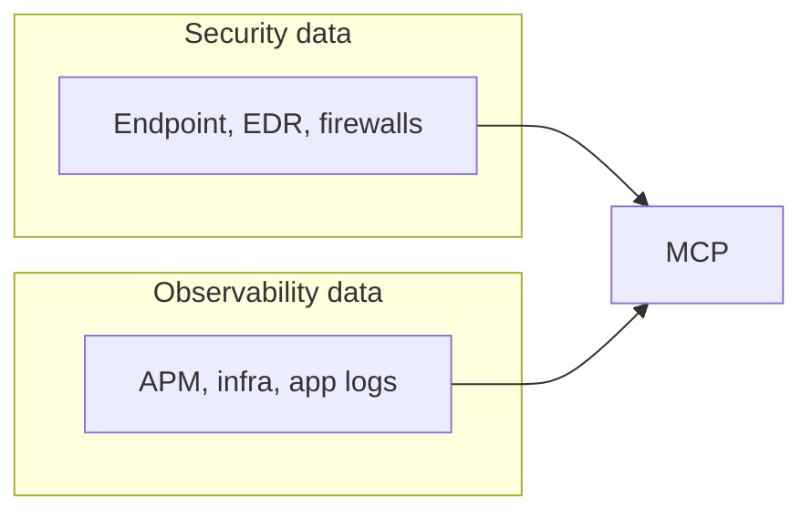

# o11y-security

Workshop and lab assets for **Agent Builder agent-to-agent (A2A)** patterns across **Elastic Cloud Serverless Observability** and **Elastic Cloud Serverless Security**: separate clusters, API-first wiring, and enriched security events with observability context.

## Why this matters: silos, AI, and MCP

Companies historically operated with **separate stacks** for platform and end users, which makes it hard to solve **AI and analytics use cases** that need unified context.

### Current state: data analytics platforms

Typical flow: **Ingest → Store → Query**

- **Observability (O11y)** telemetry is siloed per team or per cluster.
- **Business data** is often not correlated or not ingested into the same analytical plane.
- **Security** teams frequently duplicate or re-copy security logs into yet another store.
- **Data quality and retention** strategy is unclear or inconsistent across domains.
- **Cost and ownership** models become overcomplicated for platform teams.

### Downstream impact: systems of action

What organizations feel when those silos persist:

- A large **shadow IT** estate of ad hoc tools and exports.
- A **best-in-class patchwork** of point solutions instead of one coherent story.
- **Security and O11y teams** still operating in parallel, not in joint workflows.
- **Missed correlation** between signals that only make sense together (attack vs. customer impact).
- **Wrong outcomes** and **dropped data** when decisions are made without full context.

### The bridge: MCP unifies Security and Observability

Elastic uses **MCP** (Model Context Protocol) to connect **security** and **observability** telemetry into **one analytical platform**, reducing silos and enabling cross-domain workflows—from triage to GenAI-assisted investigation.



This repository’s **Agent Builder A2A** lab is one concrete pattern on that path: **Security** agents ask **Observability** for live context over APIs, so enriched incidents answer *“was this attack coupled with real user or service pain?”* without duplicating the entire analytics stack.

## Goals

- Stand up **two** serverless projects (Observability + Security) the way many customers run them: **split ownership**, shared narrative.
- Teach a **Security** detection agent to call an **Observability** context agent over **HTTPS**, merge responses, and index **correlated** documents for dashboards and automation.
- Offer a **fast scripted path** on real Elastic Cloud projects, plus an **Instruqt** track for guided delivery—port from the former to the latter as the story stabilizes.

## Repository layout

| Path | What it is |
| ---- | ----------- |
| [`elastic-agent-builder-a2a-workshop/`](elastic-agent-builder-a2a-workshop/) | **Instruqt** track: `track.yml`, `config.yml`, challenges (`01-`…`06-`), index templates, sample NDJSON/JSON, lifecycle scripts (`setup-workstation`, `check-workstation`, `solve-workstation`), agent scaffolds. |
| [`elastic-agent-builder-a2a-cloud-path/`](elastic-agent-builder-a2a-cloud-path/) | **Cloud bootstrap** (no Instruqt): bash + `curl` to create both serverless projects, mint Elasticsearch API keys, apply workshop templates, bulk-load synth data. See its `README.md` and `AGENT_BUILDER.md`. |
| [`docs/`](docs/) | Short **GitHub Pages** slide deck (`index.html`) for the value prop; optional marketing aid, not the main lab. |

## Two ways to run the lab

### A) Instruqt (facilitator-led)

1. Clone this repo and use the Instruqt CLI against `elastic-agent-builder-a2a-workshop/` (see [Instruqt docs](https://docs.instruqt.com/) for `track push`, sandboxes, and secrets).
2. Learners get a **workstation** container plus instructions to create **two** Elastic Cloud projects (or you pre-seed credentials via Instruqt secrets and track scripts).
3. Challenges walk Kibana Agent Builder steps, A2A wiring, and a correlation dashboard.

Start at: [`elastic-agent-builder-a2a-workshop/track.yml`](elastic-agent-builder-a2a-workshop/track.yml).

### B) Elastic Cloud scripts (faster iteration)

1. Elastic Cloud **organization API key** with permission to create serverless projects (`EC_API_KEY` — see Elastic **cloud-setup** / Cloud console API keys; do not commit secrets).
2. From [`elastic-agent-builder-a2a-cloud-path/`](elastic-agent-builder-a2a-cloud-path/):

   ```bash
   cd elastic-agent-builder-a2a-cloud-path
   cp env.example .env   # edit: set EC_API_KEY, optional EC_REGION / A2A_NAME_PREFIX
   bash scripts/00-check-prereqs.sh
   bash scripts/run-all.sh
   ```

3. Follow [`elastic-agent-builder-a2a-cloud-path/AGENT_BUILDER.md`](elastic-agent-builder-a2a-cloud-path/AGENT_BUILDER.md) to build agents in each **Kibana** (no stable public “create agent from JSON” API in this repo).

Details: [`elastic-agent-builder-a2a-cloud-path/README.md`](elastic-agent-builder-a2a-cloud-path/README.md).

## Agent Builder (manual in Kibana)

Authoring stays in **Agent Builder** in each project. Payload shapes and pseudocode live under:

[`elastic-agent-builder-a2a-workshop/agent-scaffolds/`](elastic-agent-builder-a2a-workshop/agent-scaffolds/)

Target indices (examples used in the workshop):

- `.elastic-agents-security-detections`
- `.elastic-agents-security-a2a-enriched`
- Synthetic bulk indices: `workshop-synth-*` (loaded by scripts for demos)

## Slides (GitHub Pages)

A **4-slide** value deck lives in [`docs/index.html`](docs/index.html), with an animated **CSS “FallingPattern”** background ([`docs/pattern.css`](docs/pattern.css))—static Pages, no React build. After enabling **Pages** from the **`/docs`** folder on `main`, it is served at:

**https://poulsbopete.github.io/o11y-security/**

**AE enablement:** copy-ready **AI prompts** for seller coaching (personas, discovery, objections) live under [`docs/prompts/`](docs/prompts/) and are linked from slides 3–4 and the footer.

Setup notes: [`docs/README.md`](docs/README.md).

## Security notes

- Never commit **`.env`**, **`state/`** under the cloud path, **`.elastic-credentials`**, or API keys. This repo’s `.gitignore` excludes common secret paths.
- Narrow the role in [`elastic-agent-builder-a2a-cloud-path/scripts/api-key-body.json`](elastic-agent-builder-a2a-cloud-path/scripts/api-key-body.json) before customer-facing demos (it is intentionally broad for lab speed).

## Related Elastic skills (optional)

If you use Claude / agent skills from Elastic, these align with the cloud path:

- **cloud-setup** — `EC_API_KEY`, region, validate Cloud API.
- **cloud-create-project** / **cloud-manage-project** — same outcomes as `01-provision-serverless.sh` and follow-on operations.

## License / status

Internal / field enablement material unless otherwise noted. Update this README as the Instruqt track and Cloud API payloads evolve.
